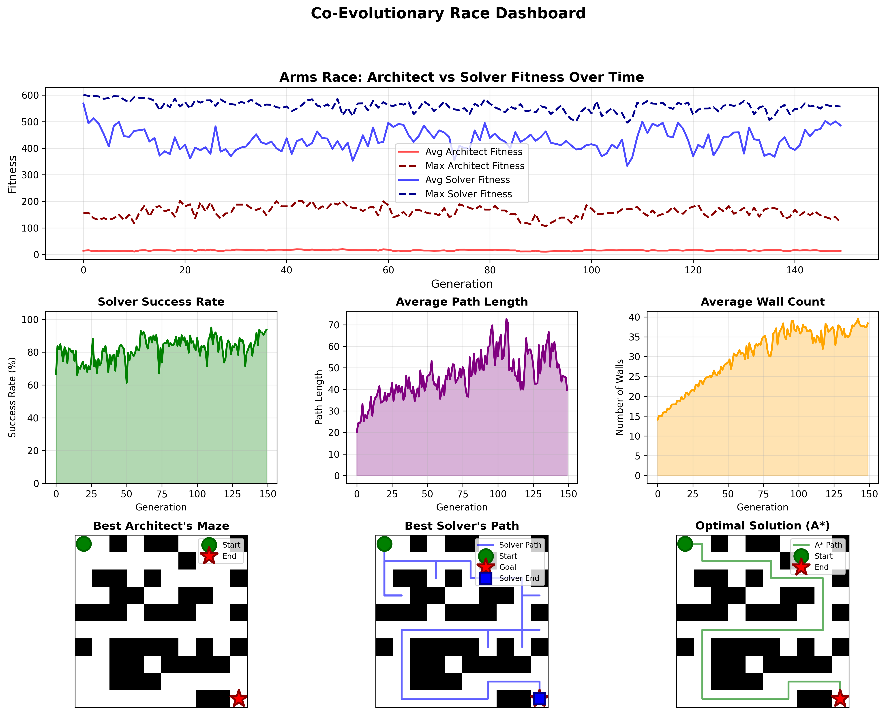

# Co-Evolutionary Maze Race

## Project Overview

This project implements a **competitive co-evolution system** inspired by biological arms races. Two populations compete:

- **Architects**: Evolve maze layouts to challenge solvers
- **Solvers**: Evolve navigation policies to solve mazes efficiently

Unlike traditional optimization where there's a fixed target, here the target continuously evolves. As solvers get better at navigating mazes, architects evolve more complex layouts. As mazes become harder, solvers develop better strategies.

## Key Features

### 1. Weight-Based Reactive Navigation for Solvers
Initially, solvers used a genome of integer sequences representing pre-planned move directions (0=North, 1=East, etc.). This approach was problematic and conceptually incorrect because the same sequence couldn't generalize across different maze layouts.

The current approach uses a **reactive policy** with 4 learned weights instead of pre-planned paths:

```
Genome: [w_goal_dist, w_wall_penalty, w_visited_penalty, w_random_exploration]
```

At each step, the solver evaluates neighboring cells using:
```
Score(cell) = w_goal_dist × (distance_improvement_to_goal)
            + w_wall_penalty × (is_wall)
            + w_visited_penalty × (visit_count)
            + w_random_exploration × (random_noise)
```

The cell with the highest score is chosen.
So with the new approach instead of co-evolving a "map" and a "fixed path"
we are co-evolving a "map" and a "navigator".

**Why this approach?**
- **Adaptive**: Weights define a policy that works across different mazes
- **Generalizable**: Same weights navigate various maze configurations
- **Evolvable**: Continuous weight space allows smooth evolution
- **Reactive**: No planning required, decisions made on-the-fly

**Weight Interpretation:**
- `w_goal_dist` (after evolution, typically positive ~0.8-2.0): Attracts agent toward goal
- `w_wall_penalty` (after evolution, typically negative ~-7.0): Strongly repels from walls
- `w_visited_penalty` (after evolution, typically negative ~-1.3): Discourages revisiting cells
- `w_random_exploration` (after evolution, typically small ~-0.5 to 0.5): Adds stochasticity

### 2. Fitness Functions

**Architect Fitness** (create challenging but solvable mazes):
```python
fitness = (difficulty_score × architect_maze_difficulty_weight) + path_complexity
```

Components:
- **Difficulty Score**: Rewards 30-70% solver failure rate (too easy or impossible is bad)
  - Scaled by `architect_maze_difficulty_weight`
- **Path Complexity**: Rewards mazes where optimal path > Manhattan distance (forces detours)
- **Solvability**: Hard constraint - unsolvable mazes get fitness = 0

**Note**: Wall density is controlled by curriculum learning, not by fitness. This hard constraint is more effective than a soft fitness reward.
More details later.

**Solver Fitness** (reach goal efficiently):
```python
# If goal reached:
fitness = solver_goal_bonus × efficiency_ratio

# If goal not reached:
fitness = solver_progress_weight × (progress_ratio²)
```

Components:
- **Goal Bonus**: Large reward for reaching the goal, scaled by efficiency
  - Scaled by `solver_goal_bonus` (default: 100.0)
- **Efficiency Ratio**: `optimal_length / actual_length` (1.0 = perfect path, <1.0 = took longer)
  - Perfect paths get full bonus, longer paths get proportionally less
- **Progress Reward**: Quadratic reward for getting close if goal not reached
  - Scaled by `solver_progress_weight` (default: 10.0)
  - Quadratic scaling means getting very close is much better than partial progress

### 3. Curriculum Learning

This part can be configured by these parameters:
```
"curriculum_learning": {
      "enabled": true,
      "initial_max_wall_density": 0.15,
      "final_max_wall_density": 0.45,
      "transition_generations": 100
    }
```
It gradually increases maze complexity over generations:

```python
# Generations 0-100: Wall density increases from 15% → 45%
current_max_density = 0.15 + (generation / 100) × (0.45 - 0.15)
```

**Why curriculum learning?**
- Prevents architects from creating impossible mazes early on
- Gives solvers time to develop basic navigation skills
- Creates smoother co-evolution dynamics

### 4. Competitive Co-Evolution Strategy

```python
# At generation t:
Architects(t) evaluated against Solvers(t-1)
Solvers(t) evaluated against Architects(t-1)
```

This ensures proper competitive dynamics where each population responds to the other's previous state.

### 5. Smart Initialization

**Solvers** start with heuristic-guided weights:
```python
w_goal_dist: 0.5 to 2.0      # Move toward goal
w_wall_penalty: -2.0 to -0.5  # Avoid walls
w_visited_penalty: -1.0 to 0.0 # Avoid revisiting
w_random: 0.0 to 0.5          # Some exploration
```

This gives evolution a better starting point than random weights.

## Project Structure

```
optimization-ai-project/
│
├── main.py                 # Main entry point and co-evolution orchestration
├── config.json            # All hyperparameters
│
├── src/
│   ├── environment.py     # Grid environment setup
│   ├── population.py      # Architect & Solver classes with fitness functions
│   ├── evolution.py       # Evolution logic (GA for architects, ES for solvers)
│   ├── metrics.py         # Performance tracking and best individual selection
│   ├── visualization.py   # Dashboard and plot generation
│   ├── history_logger.py  # Evolution history tracking
│   └── utils.py          # A* pathfinding, simulation, solvability checks
│
└── output/               # Generated visualizations and metrics
    ├── dashboard.png
    ├── metrics.json
    ├── evolution_history.json
    └── genetic_operations.json
```

## Installation

```bash
# Create a virtual environment and activate it

# Install dependencies
pip install -r requirements.txt

# Run the co-evolution
python3 main.py
```

## Configuration

All parameters are in `config.json`:

```json
{
  "environment": {
    "grid_size": 10,
    "start_pos": [0, 0],
    "end_pos": [9, 9]
  },
  "architects": {
    "population_size": 20,
    "mutation_rate": 0.15,
    "crossover_rate": 0.8,
    "elite_size": 2,
    "tournament_size": 5
  },
  "solvers": {
    "population_size": 30,
    "max_moves": 200,
    "selection_size": 10,
    "weight_mutation_stddev": 0.3
  },
  "evolution": {
    "max_generations": 150,
    "curriculum_learning": {
      "enabled": true,
      "initial_max_wall_density": 0.15,
      "final_max_wall_density": 0.45,
      "transition_generations": 100
    }
  },
  "fitness": {
    "architect_maze_difficulty_weight": 2.0,
    "solver_goal_bonus": 100.0,
    "solver_progress_weight": 10.0
  }
}
```

## Evolution Strategies

This project uses **different optimization strategies** for the two populations, tailored to their genome types:

### Architects: Genetic Algorithm (GA)
**Genome type:** Discrete binary grid (10×10 = 100 bits)

**Why GA?** Discrete search spaces benefit from crossover and stochastic selection.

**Operators:**
- **Selection**: Tournament selection (with configurable `tournament_size`) - stochastic, maintains diversity
- **Crossover**: Single-point crossover at random row (with configurable `crossover_rate`)
- **Mutation**: Bit-flip (with configurable probability per cell)
- **Elitism**: Keep top individuals unchanged (configurable number)
- **Constraints**: Ensures start/end are empty, maze is solvable, respects wall density limits

### Solvers: Evolutionary Strategy (ES)
**Genome type:** Continuous weight vector (4 floats)

**Why ES?** Continuous optimization is more effective with gradient-like perturbations than crossover.

**Operators:**
- **Selection**: Truncated deterministic selection, keeps top parents (μ is configurable)
- **Crossover**: None (not effective for continuous spaces)
- **Mutation**: Gaussian noise added to the weights (the standard deviation is configurable)
- **Strategy**: (μ + λ) ES where parents and offspring compete for the spots

**How (μ + λ) works:**
1. Evaluate all current solvers' fitness
2. Select top μ as parents
3. Generate λ offspring by mutating parents (round-robin)
4. Evaluate offspring fitness immediately
5. Combine parents + offspring
6. Select best ones for next generation

The choice of (μ + λ) strategy keeps the best from both parents and offspring, providing elitism while maintaining diversity.

## Results

Results of course are strongly influenced by the choice of values for the parameters. Being a lot of parameters,
it is difficult to get a complete and perfect overview, but some considerations can be made especially when using 
"reasonable" configurations:

- **Wall Count**: it's constrained by the incremental growth (defined by curriculum learning),
but usually it doesn't reach the maximum density allowed (e.g. max of 38 walls out of 100 cells, even with 45% max density).
This probably depends on the particular conditions of the problem.
- **Success Rate**: strongly depends mostly on the population sizes, with "reasonable" parameters fluctuates between 70% and 90%
- **Path Complexity**: Optimal paths increase of course while the architects evolve, as there are more walls.
- **Solver Weights**: Converge to strong wall avoidance (w_wall ≈ -7.0)
- **Fitness Evolution**: represents co-evolutionary dynamics (not flat lines)

### Visualization


The dashboard (`output/dashboard.png`) shows:
1. **Fitness Over Time**: Arms race dynamics between populations
2. **Success Rate**: Percentage of solver-architect pairs where solver succeeds
3. **Path Length**: Average successful path length over generations
4. **Wall Count**: Maze complexity evolution
5. **Best Architect's Maze**: Most challenging evolved maze (the one with highest architect fitness)
6. **Best Solver's Path**: The solver that performs best on the hardest maze
   - **Note**: Since the best architect's maze is the hardest one, the best solver may not always reach the goal. If no solver can solve it, the visualization shows the solver that got closest to the goal.
7. **Optimal Solution**: A* reference path for the hardest maze (shows the theoretical optimal solution)

## Key Insights

1. **Co-evolution creates complexity**: Mazes evolve from simple (14 walls) to complex (38 walls)
2. **Wall avoidance dominates**: Evolved solvers have w_wall ≈ -7.0 (strongest weight)
3. **Curriculum learning essential**: Gradual difficulty ramp prevents premature convergence
4. **Fitness scale matters**: Small differences need to be visible for selection pressure
5. **Sampling creates variance**: Random subsets prevent over-smoothing of fitness signals

## Future Enhancements

Potential improvements:
- **Larger grids**: Test scalability to 20×20 or 50×50 mazes
- **Multi-objective optimization**: Pareto front for architect objectives
- **Neural network solvers**: Replace weights with small neural networks
- **Dynamic obstacles**: Moving walls or time-varying mazes
- **Multiple goals**: Mazes with waypoints or multiple exits
- **Transfer learning**: Test if evolved weights generalize to new maze sizes
